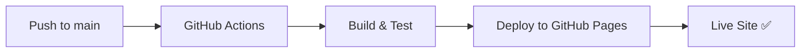

<div align="center">

# 📱 Phone Catalog Frontend

### A modern online electronics store with an intuitive interface

[](https://team-project-phone-catalog.github.io)
[](https://reactjs.org/)
[](https://www.typescriptlang.org/)
[](https://vitejs.dev/)
[](LICENSE)

[🚀 Live Demo](https://team-project-phone-catalog.github.io) • [📖 Documentation](#-project-structure) • [🤝 Contribute](#-contributing)


</div>

---

## 📋 About The Project

**Phone Catalog** is a **full-featured web application** for browsing and purchasing electronics. Built with **modern technologies**, it delivers exceptional performance and an outstanding user experience across all devices.

> 💡 **Educational project** by a development team showcasing web development best practices

---

## ✨ Key Features

<table>
<tr>
<td width="50%">

### 🛍️ For Shoppers
- 📱 **Extensive catalog** of products
- 🔍 **Smart search** with instant results
- 🛒 **Shopping cart** with real-time updates
- ❤️ **Favorites** to save products
- 📊 **Sorting** by various parameters
- 🎯 **Filtering** by categories

</td>
<td width="50%">

### 💻 Technical Advantages
- ⚡ **Fast** thanks to Vite
- 📱 **Responsive design** for all devices
- 🎨 **Modern UI/UX** with smooth animations
- ♿ **Accessibility** compliant
- 🔒 **TypeScript** for code reliability
- 🚀 **Auto-deploy** via GitHub Actions

</td>
</tr>
</table>

---

## 🛠️ Technology Stack

### Frontend Technologies

| Technology | Version | Purpose |
|------------|---------|---------|
| **React** | `18.3` | UI library |
| **TypeScript** | `5.6` | Type safety |
| **Vite** | `6.0` | Build tool |
| **React Router** | `v7` | Routing |
| **SCSS** | Latest | Styling |

### Development Tools

```bash
├── ESLint          # Code linting
├── Prettier        # Code formatting
├── Husky           # Git hooks
├── lint-staged     # Pre-commit checks
└── GitHub Actions  # CI/CD pipeline
```

---

## 🚀 Quick Start

### Prerequisites

> ⚠️ **Required:** Node.js v16.0 or higher

### Installation

**1️⃣ Clone the repository**
```bash
git clone https://github.com/Team-Project-Phone-catalog/team-project-phone-catalog.github.io.git
cd team-project-phone-catalog.github.io
```

**2️⃣ Install dependencies**
```bash
npm install
```

**3️⃣ Start the project**
```bash
npm run dev
```

**4️⃣ Open your browser**
```
http://localhost:5173
```

### 📝 Available Commands

| Command | Description |
|---------|-------------|
| `npm run dev` | 🔥 Start dev server with hot reload |
| `npm run build` | 📦 Build production bundle |
| `npm run preview` | 👀 Preview production build |
| `npm run lint` | 🔍 Check code with ESLint |
| `npm run format` | ✨ Format code with Prettier |

---

## 📦 Project Structure

```
team-project-phone-catalog.github.io/
│
├── 📂 .github/
│   └── workflows/           # ⚙️ GitHub Actions CI/CD
│
├── 📂 public/              # 🌍 Static files
│   ├── api/                # 📊 JSON data
│   │   ├── phones.json
│   │   ├── tablets.json
│   │   └── accessories.json
│   └── img/                # 🖼️ Product images
│       ├── phones/
│       ├── tablets/
│       └── accessories/
│
├── 📂 src/
│   ├── 📂 components/      # ⚛️ React components
│   │   ├── Header/         # 🎯 Site header
│   │   ├── Footer/         # 📄 Footer
│   │   ├── Cart/           # 🛒 Shopping cart
│   │   ├── Catalog/        # 📚 Product catalog
│   │   ├── ProductCard/    # 🎴 Product card
│   │   └── ui/             # 🎨 UI components
│   │
│   ├── 📂 pages/           # 📄 Pages
│   │   ├── HomePage.tsx
│   │   ├── PhonesPage.tsx
│   │   ├── TabletsPage.tsx
│   │   ├── AccessoriesPage.tsx
│   │   ├── ProductDetailsPage.tsx
│   │   ├── CartPage.tsx
│   │   ├── FavouritesPage.tsx
│   │   └── NotFoundPage.tsx
│   │
│   ├── 📂 hooks/           # 🎣 Custom hooks
│   ├── 📂 context/         # 🔄 Context providers
│   ├── 📂 api/             # 🌐 API services
│   ├── 📂 types/           # 📝 TypeScript types
│   ├── 📂 utils/           # 🛠️ Utilities
│   ├── 📂 constants/       # 📌 Constants
│   ├── 📂 styles/          # 💅 Global styles
│   │
│   ├── App.tsx             # 🏠 Main component
│   ├── main.tsx            # 🚪 Entry point
│   └── index.css
│
├── 📄 package.json
├── 📄 tsconfig.json
├── 📄 vite.config.ts
├── 📄 eslint.config.js
└── 📄 README.md
```

---

## 🎯 Features In Detail

### 🛍️ Product Catalog

<table>
<tr>
<td>

**Product Categories:**
- 📱 Phones
- 📲 Tablets
- 🎧 Accessories

</td>
<td>

**Capabilities:**
- 🔍 Search by name/brand
- 🎚️ Filter by specifications
- 📊 Sort (price, popularity, newest)

</td>
</tr>
</table>

### 🛒 Shopping Experience

```typescript
// Core cart functionality
✅ Add products with quantity selection
✅ Remove products
✅ Real-time quantity updates
✅ State persistence (localStorage)
✅ Total price calculation
✅ Checkout process
```

### 🎨 User Interface

> **Modern design** focused on simplicity and usability

- ✨ Smooth animations and transitions
- 🎭 Loading states
- ⚠️ Error handling
- ♿ Accessibility (WCAG 2.1)
- 📱 Mobile-first approach

---

## 🚀 Deployment

### Automated CI/CD Pipeline



| Deploy Type | Source | URL |
|-------------|--------|-----|
| **Production** | `main` branch | [team-project-phone-catalog.github.io](https://team-project-phone-catalog.github.io) |
| **Preview** | Pull Requests | Automatic preview URLs |

**⏱️ Build time:** ~1-2 minutes  
**🔄 Updates:** Automatic on push

---

## 📊 Project Statistics

<div align="center">

### Code Composition


</div>

---

## 🤝 Contributing

We welcome your contributions! 🎉

### How to contribute:

1. **🍴 Fork** the project
2. **🌿 Create** a branch (`git checkout -b feature/AmazingFeature`)
3. **💾 Commit** your changes (`git commit -m 'Add some AmazingFeature'`)
4. **📤 Push** to the branch (`git push origin feature/AmazingFeature`)
5. **🎁 Open** a Pull Request

### Contribution Guidelines:

- ✅ Follow code style (ESLint + Prettier)
- ✅ Write clear commit messages
- ✅ Add comments to complex code
- ✅ Test changes before PR

---

## 👥 Team

<div align="center">

### Developed by **Team-Project-Phone-catalog**

👨‍💻 **3 contributors** worked on this project

[View all contributors →](https://github.com/Team-Project-Phone-catalog/team-project-phone-catalog.github.io/graphs/contributors)

</div>

---

## 🔗 Useful Links

| Resource | Link |
|----------|------|
| 🌐 **Live Demo** | [team-project-phone-catalog.github.io](https://team-project-phone-catalog.github.io) |
| 💻 **GitHub Repo** | [Repository](https://github.com/Team-Project-Phone-catalog/team-project-phone-catalog.github.io) |
| 📚 **Tech Stack** | [TECH_STACK.md](./TECH_STACK.md) |
| ✅ **Task List** | [TASK_CHECKLIST.md](./TASK_CHECKLIST.md) |
| 🐛 **Issues** | [Report Bug](https://github.com/Team-Project-Phone-catalog/team-project-phone-catalog.github.io/issues) |

---

## 📄 License

This project was created for **educational purposes**.

---

## 📞 Contact

Have questions or suggestions? We're always happy to hear from you! 💬

- 🐛 [Report a bug](https://github.com/Team-Project-Phone-catalog/team-project-phone-catalog.github.io/issues/new)
- 💡 [Request a feature](https://github.com/Team-Project-Phone-catalog/team-project-phone-catalog.github.io/issues/new)
- 📧 [Create an Issue](https://github.com/Team-Project-Phone-catalog/team-project-phone-catalog.github.io/issues)

---

<div align="center">

### ⭐ Don't forget to star the project if you like it!

**Made with ❤️ by Team-Project-Phone-catalog**

[](https://github.com/Team-Project-Phone-catalog/team-project-phone-catalog.github.io)
[](https://github.com/Team-Project-Phone-catalog/team-project-phone-catalog.github.io/fork)

</div>
